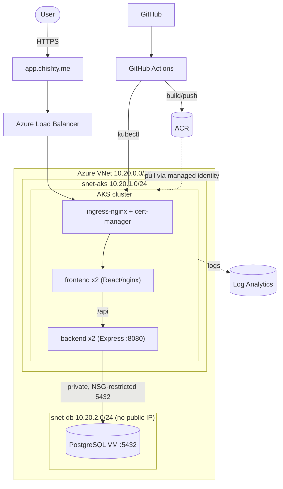

# DevOps Assessment — Production-Style Kubernetes Platform on Azure

A small but production-shaped platform: a React frontend and Node/Express backend,
containerized and shipped through CI/CD, running on **AKS**, provisioned end-to-end by
**custom Terraform modules**, and backed by a **private PostgreSQL** that is never exposed
to the internet. Live over HTTPS at **https://app.chishty.me**.


-7B42BC?logo=terraform&logoColor=white)


## Architecture



**Request path:** browser → `app.chishty.me` → Azure LB → ingress-nginx (TLS) → frontend →
`/api` proxy → backend → private PostgreSQL. The backend is internal-only; the DB has no
public endpoint.

## Stack

| Layer | Choice |
|---|---|
| Frontend | React (Vite) served by nginx |
| Backend | Node.js + Express on :8080 |
| Containers | Multi-stage Docker, non-root, `.dockerignore` |
| CI/CD | GitHub Actions → GHCR/ACR, SHA-tagged images, release on tags |
| Cluster | Azure AKS (Azure CNI, network policy), Log Analytics |
| Registry | Azure Container Registry |
| IaC | Terraform, custom modules, remote state + locking |
| Ingress/TLS | ingress-nginx + cert-manager + Let's Encrypt |
| Database | PostgreSQL on a private VM, private DNS, no public IP |

## Repository layout

```
frontend/            React app + Dockerfile + nginx.conf
backend/             Express API + Dockerfile + tests
docker-compose.yml   Run both apps locally
.github/workflows/   CI/CD pipeline
k8s/                 Deployments, Services, Ingress, ConfigMap, Secret example
terraform/           Custom modules: network, acr, monitoring, aks, database
docs/                Walkthrough, decisions, troubleshooting, private DB, future work
```

## Run locally

```bash
docker compose up -d --build
curl http://localhost:8080          # Application is running
curl http://localhost:8080/health   # {"status":"ok"}
# dashboard at http://localhost:8081
```

## Provision & deploy (summary)

1. **Infra:** `cd terraform && terraform apply -var-file=environments/dev.tfvars`
   (creates network, ACR, AKS, monitoring, private DB). See [`terraform/README.md`](terraform/README.md).
2. **Images:** `az acr build -r <acr> -t backend:v2 ./backend` (and frontend).
3. **Deploy:** create the DB Secret from `terraform output`, then `kubectl apply -f k8s/`.
4. **Ingress + TLS:** install ingress-nginx + cert-manager, point DNS at the LB IP, apply
   the ingress — Let's Encrypt issues the cert automatically.

## Documentation

- [`docs/walkthrough.md`](docs/walkthrough.md) — storytelling build log, every phase and why.
- [`docs/decisions.md`](docs/decisions.md) — key design decisions and trade-offs.
- [`docs/private-database.md`](docs/private-database.md) — Task 4 private-connectivity design.
- [`docs/ci-cd.md`](docs/ci-cd.md) — pipeline explained + secret handling.
- [`docs/troubleshooting.md`](docs/troubleshooting.md) — the 15 assessment questions.
- [`docs/troubleshooting-log.md`](docs/troubleshooting-log.md) — real failures hit & fixed.
- [`docs/future-improvements.md`](docs/future-improvements.md) — production hardening roadmap.
- [`terraform/README.md`](terraform/README.md) — Terraform structure & maintenance (Task 5).

## Security notes

No secrets in git (`.gitignore` blocks state, tfvars, env files, keys). DB password is
generated by Terraform and injected as a Kubernetes Secret at deploy time. Backend is
internal-only; database has no public IP and is NSG-restricted to the AKS subnet. Images
are non-root and tagged by commit SHA (never `latest` as the deploy reference).
