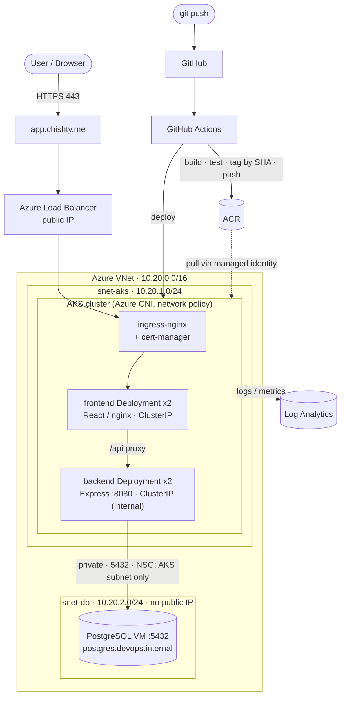

# Production-Style Kubernetes Platform on Azure

> A React + Node app, containerized and shipped through CI/CD, running on **AKS**,
> provisioned end-to-end by **custom Terraform modules**, fronted by **NGINX Ingress with an
> automatic Let's Encrypt certificate**, and backed by a **private PostgreSQL that is never
> exposed to the internet**. Live result: `curl -I https://app.chishty.me` → `HTTP/2 200`.


---

## Why this project

The goal wasn't just "make the app run" — it was to **design, automate, secure, and
operate** a production-style platform the way a DevOps engineer actually does, and to
**document the reasoning behind every command and every file**. Everything here is
Infrastructure as Code and pipeline-driven: nothing was clicked together in the portal
and left undocumented. Along the way I hit and **debugged several real cloud failures**
(constrained RBAC, subscription SKU/region restrictions, and a five-layer ingress→TLS
outage) — which, honestly, is the part that mirrors the real job. Those are written up in
[`docs/troubleshooting-log.md`](docs/troubleshooting-log.md).

**Live:** https://app.chishty.me — valid Let's Encrypt cert, HSTS, backend private, DB private.

---

## Architecture



**Request path:** browser → `app.chishty.me` (DNS A record) → Azure Load Balancer →
ingress-nginx (TLS terminate) → frontend Service → a frontend Pod → the React app calls
`/api`, which nginx proxies to the **internal** backend Service → the backend queries the
**private** PostgreSQL over `5432`, allowed only from the AKS subnet by NSG.

---

## What this demonstrates (skills)

| Area | Concretely, in this repo |
|------|--------------------------|
| **App + containers** | Separate React/Express apps; multi-stage Dockerfiles; non-root; `.dockerignore`; Compose for local |
| **CI/CD** | GitHub Actions: checkout → install → test → build → **SHA-tag** → push → release on tags → deploy |
| **Cloud / IaC** | AKS, ACR, VNet/subnets/NSGs, Log Analytics, private DB — all via **custom Terraform modules** |
| **Terraform practice** | Remote state (Azure Storage) + blob-lease locking; per-env tfvars; generated secrets; no secrets in code |
| **Kubernetes** | Deployments (2 replicas), readiness + liveness probes, requests/limits, ConfigMap, Secret, Service, Ingress |
| **Networking & security** | Private subnets, NSG least-privilege (5432 → AKS only), private DNS, internal-only backend, no public DB |
| **Ingress & TLS** | ingress-nginx on a real Azure LB; cert-manager + Let's Encrypt (HTTP-01) auto-issued cert |
| **Secret management** | Generated DB password, injected as a K8s Secret from Terraform output; Key Vault as the prod path |
| **Day-2 / troubleshooting** | Rolling updates; layer-by-layer diagnosis of RBAC, SKU/region, and ingress/TLS failures |
| **Documentation** | Storytelling walkthrough, decisions log, real troubleshooting log, Task-specific design docs |

---

## The stack

| Component | Choice / version |
|-----------|------------------|
| Cloud | Azure — AKS v1.35, 2× `standard_d2as_v7` nodes, Azure CNI + network policy |
| Frontend | React (Vite) served by nginx 1.27 |
| Backend | Node.js 22 + Express, `/`, `/health`, `/api/*` on `:8080` |
| CI/CD | GitHub Actions → GHCR/ACR, images tagged by commit SHA |
| Registry | Azure Container Registry (managed-identity pull) |
| Ingress | ingress-nginx (Azure Load Balancer) |
| Certificates | cert-manager + Let's Encrypt (ACME HTTP-01) |
| Database | PostgreSQL 14 on a private Azure VM, private DNS, no public IP |
| IaC | Terraform (azurerm 4.x), custom modules, remote state + locking |
| Monitoring | Azure Log Analytics (AKS add-on) |

---

## Repository layout

```
.
├── README.md                    ← you are here
├── frontend/                    ← React app + Dockerfile + nginx.conf
├── backend/                     ← Express API + Dockerfile + tests
├── docker-compose.yml           ← run both apps locally
├── .github/workflows/deploy.yml ← CI/CD pipeline
├── k8s/                         ← Deployments, Services, Ingress, ConfigMap, Secret example, ClusterIssuer
├── terraform/                   ← custom modules: network, acr, monitoring, aks, database
│   ├── main.tf · variables.tf · outputs.tf · provider.tf · backend.tf
│   ├── environments/            ← dev.tfvars (gitignored) + dev.example.tfvars
│   └── modules/                 ← network · acr · monitoring · aks · database
└── docs/
    ├── walkthrough.md            ← storytelling build log (every phase + why)
    ├── decisions.md              ← design decisions & trade-offs
    ├── private-database.md       ← Task 4: private connectivity design
    ├── ci-cd.md                  ← pipeline + secret handling
    ├── troubleshooting.md        ← Task 6: the 15 assessment questions
    ├── troubleshooting-log.md    ← real failures: symptom → root cause → fix → lesson
    └── future-improvements.md    ← Task 7: production hardening roadmap
```

---

## Run it locally

```bash
docker compose up -d --build
curl http://localhost:8080          # Application is running
curl http://localhost:8080/health   # {"status":"ok"}
# open http://localhost:8081 for the dashboard
```

## Reproduce on Azure (short version)

> Full, explained version with the *why* behind every step: **[`docs/walkthrough.md`](docs/walkthrough.md)**.

1. **Remote state:** create a storage account + container; auth via `ARM_ACCESS_KEY`.
2. **Infra:** `cd terraform && terraform apply -var-file=environments/dev.tfvars` — network,
   ACR, AKS, monitoring, and the private PostgreSQL VM. See [`terraform/README.md`](terraform/README.md).
3. **Images:** `az acr build -r <acr> -t backend:v2 ./backend` (and `frontend`).
4. **Secret + deploy:** create the DB Secret from `terraform output`, then `kubectl apply -f k8s/`.
5. **Ingress + TLS:** install ingress-nginx + cert-manager, point a DNS A record at the LB IP,
   apply the ingress — the certificate issues automatically.

---

## Real problems I solved (the interesting part)

Each is fully written up in [`docs/troubleshooting-log.md`](docs/troubleshooting-log.md):

1. **`AuthorizationFailed` on every `az` command** — the active subscription was a guest
   tenant, not one I had a role on. Being able to *see* a subscription ≠ having rights.
2. **Constrained Owner (ABAC)** — my Owner role could only assign the *Owner* role, so
   Terraform couldn't create the `Network Contributor` / `AcrPull` assignments AKS needs.
   Worked around by granting **Owner scoped narrowly** to the VNet and ACR.
3. **B-series VMs blocked** — the subscription's offer disallowed `Standard_B2s`; read the
   error, switched to an allowed `standard_d2as_v7`.
4. **Managed PostgreSQL region-restricted** — pivoted to a **VM-based PostgreSQL** in the
   private subnet, keeping the whole private-connectivity design intact.
5. **Ingress timed out → TLS wouldn't issue** — a five-layer failure: BYO-NSG missing
   80/443, wrong NSG destination, and (the real cause) the **Azure LB health probe** hitting
   `/` and getting a 308 instead of 200 → all backends unhealthy. Fixed with the `/healthz`
   probe path; the cert then issued in 26 seconds.

> This log is the most valuable file here — it shows layer-by-layer diagnosis, not just
> following a tutorial.

---

## Cloud translation (Azure → AWS)

`AKS → EKS` · `ACR → ECR` · `VNet → VPC` · `NSG → Security Group` · `Azure DNS private zone →
Route 53 private hosted zone` · `Log Analytics → CloudWatch` · `Key Vault → Secrets Manager`
· `Azure Load Balancer → NLB/ELB`. Kubernetes, Terraform, Docker, and the CI/CD pipeline are
identical across clouds — only the provider resources change.

---

## Security notes

No secrets in git (`.gitignore` blocks `*.tfstate`, `*.tfvars`, `.env`, keys). The DB
password is **generated by Terraform** and injected as a Kubernetes Secret at deploy time —
never committed. The backend is **internal-only**; the database has **no public IP** and is
NSG-restricted to the AKS subnet. Images run **non-root** and are tagged by **commit SHA**
(never `latest` as the deploy reference). Remote state lives in a locked-down, non-public
storage account with versioning + soft delete.

---

*Built hands-on as a DevOps engineering exercise. The walkthrough and troubleshooting docs
are written in a storytelling style so they double as study notes.*
